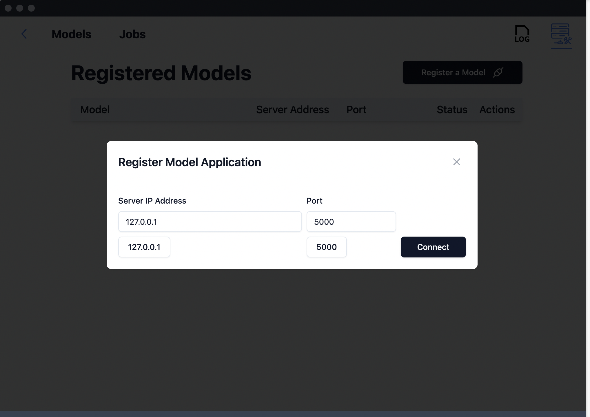
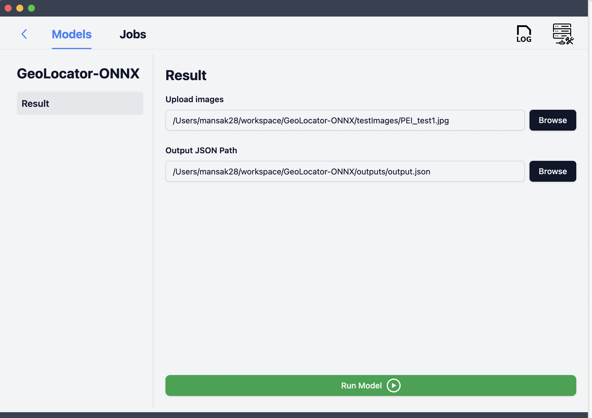
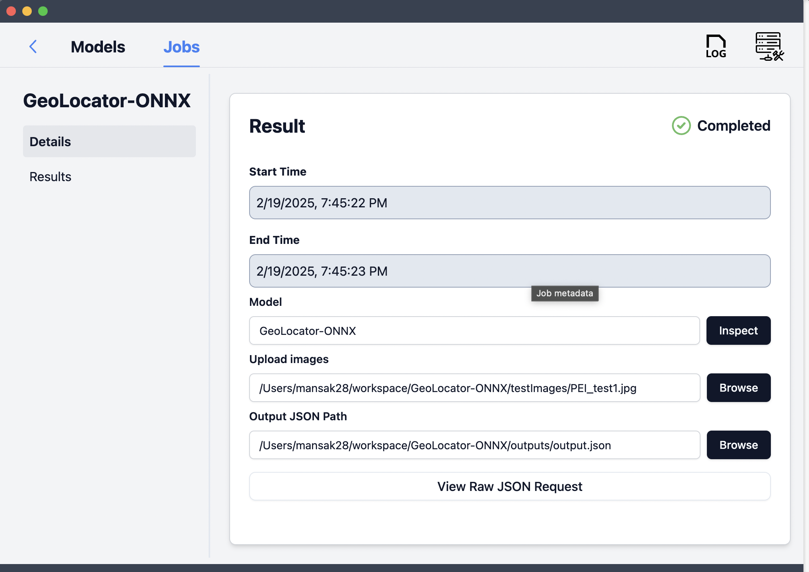

# GeoLocator-ONNX
Converted Rescue Lab's GeoLocator-IO Classifier to ONNX Format, and ran it using RescueBox frontend. 

## Steps to Export ONNX Model:

* Start by cloning and setting up the original local development environment for the [GeoLocator application]([url](https://github.com/UMass-Rescue/GeoLocator)).  Follow the instructions provided in their ReadMe, including installing the dependencies from requirements.txt and setting up a virtual environment.
* Again following the instructions in the original project's ReadME, use RescueBox Desktop as the frontend and get the GeoLocator application successfully working (should be able to upload an image and see its classification). (You can use test images from the Internet, or from the testImages directory in this project.)
* Once the model is successfully working, implement the following to export it to ONNX format:
  * Set a breakpoint around line 196, right before the line `logit = model.forward(input_img)` in the  `run_iodetector` function. This         should look like: `pdb.set_trace()`. (Make sure to import pdb!) This is the line where the prediction is being made, so we want the          execution of the model to stop before this line so we can export it to ONNX.
  * Run the model again using the RescueBox frontend.
  * When the breakpoint is triggered in the backend, run the following code from the terminal:
  ```
  torch.onnx.export(
    model,              
    input_img,        
    "iodetector.onnx",   
    export_params=True, 
    opset_version=16,    
    do_constant_folding=True, 
    input_names=["input"],  
    output_names=["output"],   
    dynamic_axes={ "input": {0: "batch_size"},"output": {0: "batch_size"}}
  )
  ```
  * This will create a file with a .ONNX extension within your project. Congrats! The first step is now over; you have exported the         
  GeoLocator model to ONNX!
  * Now, write pre-processing and post-processing code that simulates the pre-processing and post-processing steps done in the original     
  project. Note: In this version, we are only simulating the Indoor/Outdoor classifier, so just write pre-processing and post-processing   
  code for that.
  * Finally, write a Flask ML server.py function to serve as the backend for the ONNX model and you're all done!!!
    
## Steps to Use the ONNX Model:

  * Clone this repository and navigate into the resulting directory:

    ```
    git clone https://github.com/padfoot2803/GeoLocator-ONNX.git
    cd GeoLocator-ONNX

    ```
  * Create a virtual environment using a preferred tool. You can use pipenv or venv. For conda, implement the following steps: `conda create 
  -n <environment_name> python=3.12` and then `conda activate <environment_name>`.
  * Install the dependencies using `pip install -r requirements.txt `.
  * RescueBox should already be installed.
  * Start the server by running `python server.py` on the terminal.
  * You can test the model using the command line interface (CLI) by running the following command: `python geolocator-cli.py --input_image (input_image_path) --output_directory (output_image_path)
  * To test the model using the frontend, register and run the model using RescueBox as previously. 

## Running RescueBox Successfully:

  * Open RescueBox and register the model:

  

  * Provide a test image (3 are provided in the testImages directory of this project, or you could download your own from the Internet) and an output directory (where output will be saved):

  

  * Run the model, see the green check mark indicating a successful run and view details:

  

  * View the results of the classification! The beach, for example, is classified as 'outdoor':

  
  
